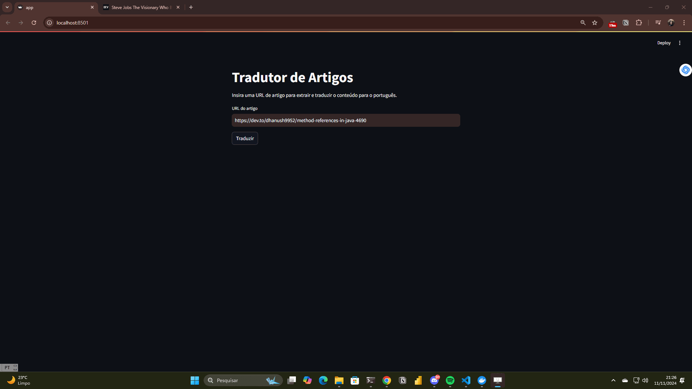

# Tradutor de Artigos com Azure e OpenAI e Docker 📰🔧
# DEMONSTRAÇÃO



⚠️ Nota: Este projeto utiliza uma conta de estudante no Azure com um limite de 1000 tokens para os modelos GPT disponíveis. Devido a isso, artigos mais extensos podem não ser completamente traduzidos.
</br>
## Visão Geral do Projeto</br>
</br>
Este projeto é um tradutor de artigos que utiliza a API de tradução do Azure e o modelo GPT da OpenAI para traduzir textos automaticamente. A aplicação foi desenvolvida em Python e possui uma interface intuitiva criada com Streamlit para facilitar a experiência do usuário. A infraestrutura é gerenciada com Docker, permitindo fácil distribuição e portabilidade.
</br>

## Ferramentas e Tecnologias Utilizadas 🛠️</br>
</br>
1. Python: Linguagem principal para desenvolvimento do backend e lógica de tradução.</br>
2. Streamlit: Criação da interface web de forma simples e rápida.</br>
3. BeautifulSoup: Para extração de texto de páginas HTML.</br>
4. Docker e Docker Compose: Conteinerização da aplicação, facilitando o deploy e garantindo portabilidade.</br>
5. Azure Cognitive Services: Serviço de tradução e modelo GPT para gerar a tradução dos textos.</br>
6. Flake8: Ferramenta de análise de estilo de código.</br>
</br>

## Estrutura de Arquivos 📂
</br>

```
DIO-AZURE-PROJETO-TRADUTOR/
├── .idea/                       # Configurações do ambiente de desenvolvimento
├── .venv/                       # Ambiente virtual do Python
├── data/
│   └── Stairway To Heaven.docx  # Exemplo de arquivo de dados
├── notebooks/
│   └── Untitled2.ipynb          # Notebooks para testes e experimentos
├── src/                         # Código fonte principal
│   ├── app.py                   # Arquivo principal para execução da aplicação
│   ├── config.py                # Configurações da API e chaves de acesso
│   ├── scraper.py               # Função para extrair texto de URLs
│   └── translator.py            # Função para traduzir textos usando a API
├── tests/
│   └── est_example.py           # Exemplo de testes
├── .env                         # Variáveis de ambiente sensíveis
├── .flake8                      # Configurações do Flake8
├── .gitignore                   # Arquivos a serem ignorados pelo Git
├── Dockerfile                   # Configuração do Docker para a aplicação
├── docker-compose.yml           # Configuração do Docker Compose
├── poetry.lock                  # Dependências gerenciadas pelo Poetry
├── pyproject.toml               # Arquivo de configuração do Poetry
└── requirements.txt             # Dependências do projeto
```
</br>

## Configuração do Projeto ⚙️
</br>
Pré-requisitos</br>
</br>
* Docker e Docker Compose instalados.</br>
* Conta no Azure com acesso ao Azure Cognitive Services.</br>
* Passo a Passo para Configuração 🔧</br>
* Configuração das Credenciais:</br>
</br>
Crie um arquivo .env na raiz do projeto com as seguintes variáveis (substitua com suas próprias chaves):</br>

```
API_KEY="sua_chave_do_gpt"
OPENAI_ENDPOINT="seu endpoind da azure openai"
```
## Construção e Execução com Docker:
</br>
No terminal, navegue até a pasta do projeto e execute:
</br>

```bash
Copiar código
docker-compose up --build
```
A aplicação estará acessível em http://localhost:8501.</br>
</br>
## Funcionamento dos Arquivos 🔍</br>

1. app.py: Inicia a aplicação Streamlit e configura a interface.</br>
2. config.py: Configura e gerencia as credenciais de API e variáveis de ambiente.</br>
3. scraper.py: Realiza a extração do conteúdo textual da URL fornecida.</br>
4. translator.py: Utiliza a API do Azure para traduzir o texto extraído.</br>
5. Dockerfile: Define a configuração da imagem Docker.</br>
6. docker-compose.yml: Organiza a estrutura de conteinerização e o ambiente com Docker Compose.</br>
</br>

## Imagens das Ferramentas 📸
</br>
1. Python
</br>
2. Docker
</br>
3. Azure Cognitive Services
</br>

## Como Usar 🚀
</br>
* Acesse a aplicação: Abra http://localhost:8501 em seu navegador.</br>
* Insira a URL de um artigo: No campo de entrada, insira a URL do artigo que deseja traduzir.</br>
* Clique em Traduzir: A tradução será exibida na mesma página, formatada em Markdown.</br>
</br>

## Observações Importantes ⚠️</br>
</br>
1- Limites de API: Como estamos usando uma conta de estudante do Azure, há um limite de tokens que pode restringir traduções de artigos longos. Substitua pela sua API</br>
</br>
2- Portabilidade: Graças ao Docker, todo o ambiente de desenvolvimento e execução está contido, facilitando o compartilhamento e a execução em diferentes máquinas.</br>
</br>
3- Segurança: As chaves de API estão protegidas pelo .env, que está listado no .gitignore para não serem publicadas no GitHub.
</br>


### Contribuições e Melhorias 🌱

</br>
Este projeto é aberto para melhorias! Sinta-se à vontade para clonar, modificar e enviar pull requests com sugestões de novas funcionalidades.
</br>

### Licença MIT
